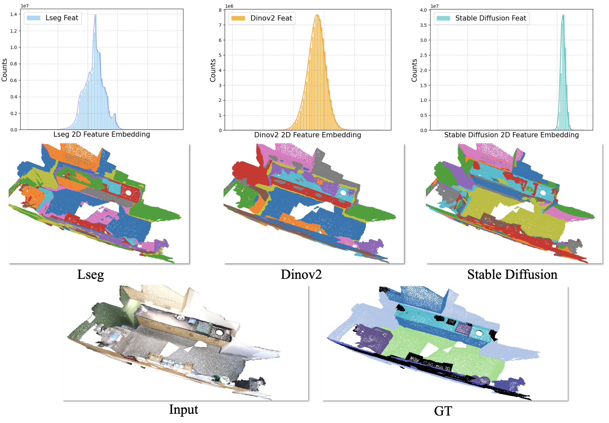
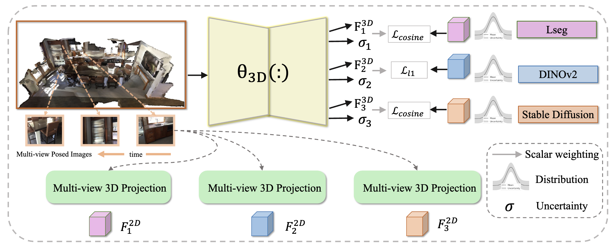

# Official Implementation of “CUA-O3D: Cross-Modal and Uncertainty-Aware Agglomeration for Open-Vocabulary 3D Scene Understanding” (CVPR 2025)

> [Cross-Modal and Uncertainty-Aware Agglomeration for Open-Vocabulary 3D Scene Understanding (CUA-O3D)](https://tyroneli.github.io/CUA_O3D/)  
> [Jinlong Li](https://tyroneli.github.io), [Cristiano Saltori](https://scholar.google.com/citations?user=PID7Z4oAAAAJ), [Fabio Poiesi](https://fabiopoiesi.github.io/), [Nicu Sebe](https://scholar.google.co.uk/citations?user=stFCYOAAAAAJ&hl=en).  
> :star: CVPR 2025

## About CUA-O3D
The lack of a large-scale 3D-text corpus has led recent works to distill open-vocabulary knowledge from vision-language models (VLMs). However, these methods typically rely on a single VLM to align the feature spaces of 3D models within a common language space, which limits the potential of 3D models to leverage the diverse spatial and semantic capabilities encapsulated in various foundation models. In this paper, we propose Cross-modal and Uncertainty-aware Agglomeration for Open-vocabulary 3D Scene Understanding dubbed CUA-O3D, the first model to integrate multiple foundation models—such as CLIP, DINOv2, and Stable Diffusion—into 3D scene understanding. We further introduce a deterministic uncertainty estimation to adaptively distill and harmonize the heterogeneous 2D feature embeddings from these models. Our method addresses two key challenges: (1) incorporating semantic priors from VLMs alongside the geometric knowledge of spatially-aware vision foundation models, and (2) using a novel deterministic uncertainty estimation to capture model-specific uncertainties across diverse semantic and geometric sensitivities, helping to reconcile heterogeneous representations during training. Extensive experiments on ScanNetV2 and Matterport3D demonstrate that our method not only advances open-vocabulary segmentation but also achieves robust cross-domain alignment and competitive spatial perception capabilities so as to provide state-of-the-art performance in tasks such as:
- 3D question answering
- Dense captioning
- Semantic understanding

Visit the [CUA-O3D website](https://tyroneli.github.io/CUA_O3D) to explore more details about the project, methodology, and results.

## Contributing
We welcome and encourage contributions to the CUA-O3D project! If you'd like to contribute:
1. Fork this repository.
2. Create a new branch for your changes.
3. Submit a pull request with a detailed description of your modifications.

Before contributing, please review our [contribution guidelines](https://github.com/tyroneli/CUA-O3D/blob/main/CONTRIBUTING.md).

## Acknowledgments
We extend our gratitude to all contributors and supporters of the CUA-O3D project. Your valuable insights and contributions drive innovation and progress in the field of **3D and language-based AI systems**.

## Contact
For questions, issues, or collaboration opportunities:
- Submit a ticket on the [issues page](https://github.com/tyroneli/CUA-O3D/issues).
- Visit the [CUA-O3D project website](https://tyroneli.github.io/CUA_O3D/).
- Alternatively, reach out via email: [jinlong.li@unitn.it](mailto:jinlong.li@unitn.it).

## Quick Links
- [CUA-O3D Website](https://tyroneli.github.io/CUA-O3D/)
- [CUA-O3D Code Repository](https://github.com/tyroneli/CUA-O3D)
- [CUA-O3D Paper on arXiv](https://arxiv.org/abs/2411.19774)

## Website License

This project is licensed under the **[Creative Commons Attribution-ShareAlike 4.0 International License](http://creativecommons.org/licenses/by-sa/4.0/)**.

For more information, visit the [Creative Commons License page](http://creativecommons.org/licenses/by-sa/4.0/).